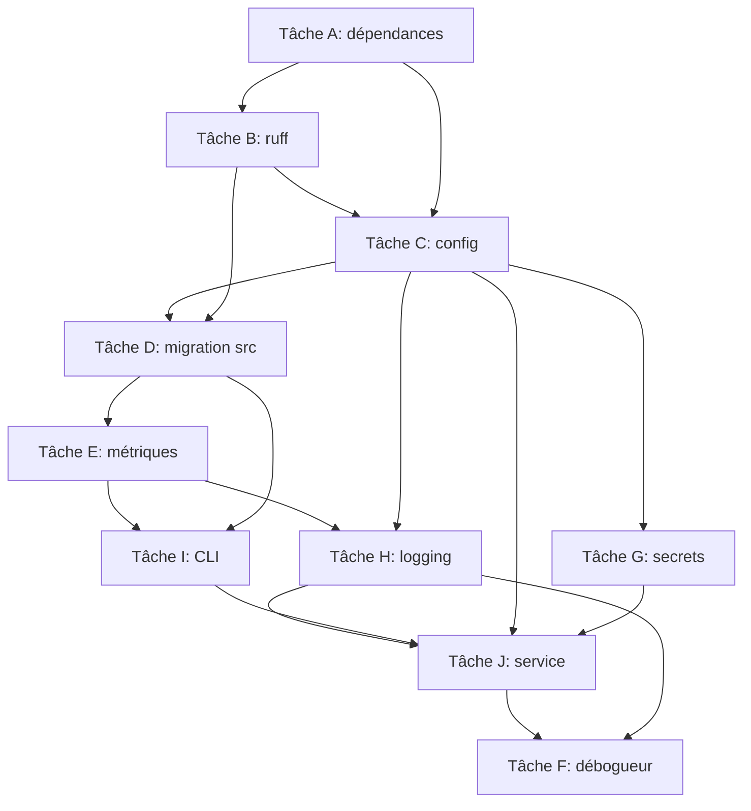

# TP1 - Développement Python pour le ML : structure de projet, bonnes pratiques, qualité de code

## Objectifs

- Mettre en place un projet Python géré par `uv`, en disposition `src/`, avec un fichier `uv.lock` commité.
- Migrer le travail exploratoire d'un notebook hérité vers un paquet structuré, puis reposer le notebook sur ce paquet plutôt que de le dupliquer.
- Répartir les dépendances héritées en dépendances de projet, groupes de dépendances et extras, avec des contraintes de versions en intervalles.
- Séparer la configuration (commitée, relue) des secrets (jamais commités, typés `SecretStr`).
- Servir le modèle derrière une API FastAPI fournie, et journaliser chaque requête avec le module `logging`.
- Savoir déboguer votre programme, plutôt que de faire des `print()` _statements_.

## Aperçu

Un notebook vous est remis. On ignore qui l'a écrit et il n'y a personne à qui poser la question : il ne reste que les notes laissées en chemin.

Le notebook se trouve dans `./notebooks/` et contient un modèle d'apprentissage automatique et certains essais pour arriver à une solution.

Vous avez à votre disposition :

- Le notebook
- Un fichier `requirements.txt` (exporté de `pip freeze -l`) : à supprimer à la fin, ou à régénérer depuis `pyproject.toml` (`uv export`)
- Une implémentation d'un modèle pour prédire : **ne vous souciez pas du modèle en soi, le but n'est pas de modéliser**.

Le travail est de transformer ce notebook petit à petit, pour y mettre un peu d'ordre et s'assurer que le projet ne tombera pas à l'eau.

## Prérequis

1. Installer `uv` et `git` (Windows : activer WSL2).
1. Cloner le dépôt de départ.
1. Récupérer les données de Moodle en CSV et parquet, et les placer dans `data/dataset.csv` et `data/dataset.parquet`.
1. Créer votre `.env` local en copiant `.env.example` et mettre une valeur aléatoire (commande dans `.env.example`).
1. Rouler `make install` pour créer l'environnement virtuel (attention, il est vide !).

## Instructions

Afin que le lab ne soit pas _excessivement_ long, nous vous fournissons du code sous `src/` ainsi que des fichiers de départ.

1. **Implémenter** tous les commentaires marqués **`# TODO(LAB)`** :
    - Respectez les signatures de fonction
1. **Effectuer les tâches** ci-dessous
1. Prenez soin de **répondre aux questions** dans `reports/tp1.md`

**Commencez par la [tâche A](#tâche-a---gestion-des-dépendances).** Tant que les dépendances ne sont pas déclarées, votre environnement virtuel est vide : `make tests`, `make code-quality` et `inferapi ...` échouent tous.

## Ordre logique de travail

Les tâches s'enchaînent : on ne peut pas tester une partie qui dépend d'une autre pas encore implémentée.



### Ordre recommandé

| Étape | Tâche | Dépend de | Pourquoi cet ordre |
|-------|-------|-----------|--------------------|
| 1 | A | rien | Tant que `.venv` est vide, tout échoue |
| 2 | B | A | `make code-quality` ne roule qu'avec `ruff` installé |
| 3 | C | A, B | Les sections typées guident tout le reste |
| 4 | D | A, B, C | On migre le notebook dans un projet outillé |
| 5 | E | D | `evaluate()` vit dans `train.py` |
| 6 | H | C | `setup_logging` dépend de `LoggingConfig` |
| 7 | I | D, E, C | `run_train` assemble tout ; rien ne s'appelle sans lui |
| 8 | G | C | `api_token` n'est utile qu'avec `InferApiSettings` |
| 9 | J | C, G, H, I | `serve.py` a besoin de `SklearnPredictor` (D) |
| 10 | F | tout | Preuves de debug : à la fin, quand tout marche |

### Quel TODO(LAB) pour quelle tâche

| Tâche | TODO(LAB) | Fichier |
|-------|-----------|---------|
| A/B | — | (installation des dépendances ; outils `ruff`) |
| C | `SecurityConfig` : ajouter `api_token` + validation | `config.py` |
| C | `InferApiSettings` : déclarer les sections du service | `config.py` |
| D | `SklearnPredictor` : implémenter la classe | `predictor.py` |
| E | `get_model_evaluation_metrics` : mêmes métriques que le notebook | `train.py` |
| E | `build_model` : pipeline avec les 2 steps, hyperparamètres depuis la config | `train.py` |
| E | `train` : split + log des shapes, puis `fit` | `train.py` |
| E | `training_procedure` : split → fit → score → log → persist | `train.py` |
| F | — | (preuves de debug dans le rapport) |
| G | — | (rien à coder : `api_token` est l'un des TODOs de C) |
| H | handler fichier `out/logs/app.log` (toujours `DEBUG`) | `logging_setup.py` |
| H | `setup_logging` : ajouter le fichier si configuré | `logging_setup.py` |
| I | arguments `--data`, `--n-estimators`, `--max-depth`, `--seed`, `--decision-threshold`, `--overwrite` | `cli.py` |
| I | `run_train` : charger le frame et l'appeler sur l'`output` demandé | `cli.py` |
| J | `SklearnPredictor` : charger l'artefact + appliquer le seuil | `predictor.py` |
| J | `load_predictor` + l'`app` de niveau module | `serve.py` |
| J | la ligne `prediction_completed` | `app.py` |

**Règle :** dans une tâche, on implémente le `TODO(LAB)` mentionné dans `tp1` **pendant** cette tâche. Les TODO ne sont pas à faire avant les tâches.

### Checklist de suivi

#### Tâches

| Étape | Tâche | Dépend de | Où est le TODO | Statut |
|-------|-------|-----------|----------------|--------|
| 1 | A | rien | (installation des dépendances) | ✅ |
| 2 | B | A | (outils `ruff`) | ✅ |
| 3 | C | A, B | `config.py` : `SecurityConfig` (`api_token`) puis `InferApiSettings` | ⬜ **← on continue ici** |
| 4 | D | A, B, C | `predictor.py` : `SklearnPredictor` | ⬜ **← on continue ici** |
| 5 | E | D | `train.py` : `build_model`, `get_model_evaluation_metrics`, `train`, `training_procedure` | ✅ |
| 6 | H | C | `logging_setup.py` : handler fichier + `setup_logging` | ⬜ |
| 7 | I | D, E, C | `cli.py` : `run_train` | ✅ |
| 8 | G | C | (rien : `api_token` est déjà dans le TODO de `config.py`) | ⬜ |
| 9 | J | C, G, H, I | `serve.py` : `load_predictor` + `app` ; `app.py` : `prediction_completed` | ⬜ |
| 10 | F | tout | (preuves de debug dans le rapport) | ⬜ |

#### TODO(LAB)

| # | TODO(LAB) | Fichier | Tâche | Dépend de | Statut |
|---|-----------|---------|-------|-----------|--------|
| 1 | `run_train` : charger le frame et appeler `training_procedure` | `cli.py` | I | #2, #7 | ✅ (à l'instant : plus que l'échec `SklearnPredictor`) |
| 2 | `training_procedure` : split → fit → score → log → persist | `train.py` | E | #3, #4 | ✅ |
| 3 | `build_model` : pipeline avec les 2 steps, hyperparamètres depuis la config | `train.py` | E | #5 | ✅ |
| 4 | `get_model_evaluation_metrics` : mêmes métriques que le notebook | `train.py` | E | #5 | ✅ |
| 5 | `train` : split + log des shapes, puis `fit` | `train.py` | E | — | ✅ |
| 6 | `SecurityConfig` : ajouter `api_token` + validation | `config.py` | C/G | #7 | ⬜ |
| 7 | `InferApiSettings` : déclarer les sections du service | `config.py` | C | — | ⬜ |
| 8 | `SklearnPredictor` : implémenter la classe | `predictor.py` | D/J | #3 | ⬜ |
| 9 | `load_predictor` + l'`app` de niveau module | `serve.py` | J | #1, #8 | ⬜ |
| 10 | handler fichier (`out/logs/app.log`, toujours `DEBUG`) | `logging_setup.py` | H | #7 | ⬜ |
| 11 | `setup_logging` : ajouter le fichier si configuré | `logging_setup.py` | H | #10 | ⬜ |
| 12 | la ligne `prediction_completed` | `app.py` | J | #9 | ⬜ |

*« Dépend de » = les numéros de TODO qu'il faut avoir écrits avant. Exemple : #2 (`training_procedure`) appelle #3 (`build_model`), #4 (`get_model_evaluation_metrics`) et #5 (`train`).*

**Dernière vérification (à l'instant) :** `uv run pytest -q` → 6 passes, 1 échec (`test_a_trained_model_can_be_loaded_back`). Seul blocage restant : TODO #8 (`SklearnPredictor`) ; après quoi il restera C (`config.py`), H (`logging_setup.py`), puis J (`serve.py`/`app.py`).

## ⚠️ Pièges récurrents

- Ne PAS corriger les erreurs `F401` avec `ruff check --fix` avant d'avoir implémenté : ces imports servent
- `SecretStr` se lit avec `.get_secret_value()`
- Les hyperparamètres ne se codent pas en dur : ils viennent de la config

## Commandes

`make help` liste toutes les cibles. Chacune ne fonctionne qu'une fois la tâche correspondante faite.

```bash
make install        # crée .venv à partir de uv.lock
make model-train    # entraîne et écrit out/models/model.joblib
make serve          # gunicorn + workers uvicorn (Windows natif : make serve-dev)
make serve-debug    # démarre le service et attend un débogueur sur le port 5678
make tests          # pytest
make code-quality   # ruff (lint + format)
make notebook-launch   # JupyterLab
make submit TEAM=X  # crée le bundle de remise
```

Une fois le service démarré (`/healthz` et `/version` sont ouverts, `/v1/predict` exige le jeton) :

```bash
curl localhost:8000/healthz
curl localhost:8000/version
curl -X POST localhost:8000/v1/predict \
  -H "ML520-API-Key: $(make secrets-show)" \
  -H 'Content-Type: application/json' -d '{
  "age": 41, "job": "technician", "marital": "married", "education": "university.degree",
  "default": "no", "housing": "yes", "loan": "no", "contact": "cellular",
  "month": "may", "day_of_week": "thu", "campaign": 1, "pdays": 999, "previous": 0,
  "poutcome": "nonexistent", "emp.var.rate": 1.1, "cons.price.idx": 93.994,
  "cons.conf.idx": -46.2, "euribor3m": 4.857, "nr.employed": 5191.0}'
```

Pour lancer un entraînement :

```bash
uv run inferapi train --output out/models/deep.joblib --max-depth 16 --n-estimators 300
uv run inferapi train --output out/models/eager.joblib --decision-threshold 0.3
uv run inferapi --log-level DEBUG train --output out/models/model.joblib
```

## Tâches

### Tâche A - Gestion des dépendances

But : S'assurer que le projet ait :

- une gestion de dépendances avec `uv`
- le(s) bon(s) groupe(s) de dépendance(s), si applicable
- le(s) bon(s) extra(s) de dépendance(s), si applicable
- le tout avec des contraintes en intervalles qui ont une bonne pertinence

Directives / pistes :

- Analyser ce qui est utilisé dans le notebook
- Un groupe `dev` doit exister et être utilisé pour installer toutes les dépendances utiles quand on roule localement
- La cible `make notebook-launch` s'attend à un groupe nommé `notebooks`
- Tout ce qui est dans `requirements.txt` n'a pas nécessairement sa place ; tout ce qui est nécessaire n'y est pas forcément.
- `scikit-learn-intelex` n'est valide que pour les architectures x86/amd64 : vos contraintes doivent le refléter.
- Une fois la migration faite, `requirements.txt` n'a plus de raison d'être : supprimez-le, ou régénérez-en un à partir de votre `pyproject.toml` si vous y tenez (`uv export`)

### Tâche B - Outils de qualité de code

But :

- Avoir du code _linting_ avec `ruff`
- Avoir du code _format_ avec `ruff`
- Faire passer le code en roulant `make code-quality` : vous devez assurer que ceci passe partout et ce jusqu'à la fin du lab

Directives / pistes :

- Ne PAS modifier les règles configurées
- Si vous mettez `ruff` dans les dépendances, assurez-vous qu'ils soient dans la bonne section
- Les erreurs `F401` du départ sont les imports que votre implémentation utilisera : implémentez-les plutôt que de les effacer avec `ruff check --fix`

### Tâche C - Configuration typée

But :

- Compléter `InferApiSettings` : les sections dont le service a besoin
- Compléter `SecurityConfig` (voir [tâche G](#tâche-g---gestion-des-secrets))

Directives / pistes :

- Le reste de `config.py` est fourni, analysez `TrainingSettings`, il est similaire à ce que vous devez faire
- Les valeurs viennent de `configs/config.yaml`
- Les variables de `TrainingSettings` et `InferApiSettings` utilisent le préfixe `ML520_` et `__` entre les niveaux
- Les deux objets lisent le même fichier YAML
- Note : L'entraînement n'a pas besoin du jeton API, et le serveur n'a pas besoin des hyperparamètres

### Tâche D - Migration du notebook vers `src/`

But :

- Avoir les tâches importantes et réutilisées dans `src`
- Migrer le pipeline et l'entraînement dans `train.py`

Directives / pistes :

- `data.py` est fourni au complet : charger un fichier et appeler `train_test_split` n'est pas ce que ce cours évalue. Lisez-le tout de même, `get_dataset` ne découpe pas comme le notebook
- Ne PAS laisser d'hyperparamètre en dur dans `src/` : ils viennent tous de la configuration
- Garder les signatures fournies
- Garder les deux étapes nommées du pipeline : `data_processor` (le `ColumnTransformer`) et `model`
- Ce qui reste dans le notebook, c'est ce qu'un humain lit : histogrammes, courbes ROC et précision-rappel, tableau de seuils
- Le notebook installe et active `scikit-learn-intelex` en plein milieu (`! pip install`, puis `patch_sklearn()`) : ces cellules n'ont pas leur place dans le résultat final. Une dépendance se déclare dans `pyproject.toml` (tâche A et question 1)
- `%load_ext autoreload` puis `%autoreload 2` évitent de redémarrer le noyau à chaque modification sous `src/`
- Note : Vous devriez obtenir à peu près les mêmes performances / même comportement

### Tâche E - Métriques d'évaluation

But :

- Migrer `evaluate()` vers `get_model_evaluation_metrics()` (dans `train.py`)
- Prendre le seuil dans `training.decision_threshold`
- Évaluer sur l'ensemble de **validation**
- Journaliser les métriques dans un seul événement `model_trained`, depuis `training_procedure()`

Directives / pistes :

- NOTE : Les métriques sont déjà choisies. Vous n'avez pas à les changer, mais vous devez comprendre pourquoi il y en a six et pas une ; laquelle est la plus importante selon vous ?
- NOTE : En théorie il faudrait réentraîner sur l'ensemble de notre jeu de données une fois notre modèle choisi. Ceci n'est pas fait dans notre cas.

### Tâche F - Le débogueur

But :

- Savoir déboguer avec un débogueur
- Être capable de faire ces trois choses :
    - arrêter l'exécution sur un point d'arrêt
    - inspecter une variable locale
    - évaluer une expression dans la console de débogage
- Savoir s'attacher à un processus déjà démarré (`make serve-debug`)

Directives / pistes :

- Avant de commencer, lire [le rapport](./reports/tp1.md) : certaines étapes doivent être prouvées par capture d'écran
- Les captures d'écran se commitent dans `reports/img/` et se référencent depuis le rapport en markdown
- Les configurations sont fournies dans `.vscode/launch.json` (PyCharm/etc. : créer les équivalentes, `Module`/`inferapi.cli` et `Module`/`uvicorn`)
- Sélectionner `.venv/bin/python` comme interpréteur
- `debugpy` est déjà dans le `requirements.txt` : à vous de choisir son groupe de dépendances
- `make serve-debug` attend que votre éditeur s'attache avant de commencer :
    - Pour atteindre un point d'arrêt dans `create_app()`, l'attente est préconisée, sinon ce serait trop rapide.

### Tâche G - Gestion des secrets

But :

- Ajouter `security.api_token`, typé `SecretStr`
- Faire échouer le chargement de la configuration si la vérification est active sans jeton
- Ajouter la validation de `SecurityConfig`

Directives / pistes :

- Le jeton n'apparaît PAS dans `configs/config.yaml`
- `.env.example` n'est pas lu, il agit en tant que _template_
- Note : un `SecretStr` se lit avec `.get_secret_value()`
- Le _flag_ `security.enable_api_key_check` doit gérer l'ajout du middleware ou non

### Tâche H - Journalisation avec `logging`

But :

- Remplacer les `print()` du notebook par des appels au module `logging` de la bibliothèque standard dans `src/`
- Avoir un niveau paramétrable par la configuration
- Avoir `out/logs/app.log` (paramétrable par la configuration) qui capture toujours le niveau `DEBUG`
- Écrire la ligne qui clôt chaque requête `/v1/predict`

Directives / pistes :

- Un _Handler_ pour la sortie stdout est fourni dans `logging_setup.py`, vous devez en créer un autre pour le fichier
- Faire attention au niveau du handler à ajouter
- Chaque module demande son logger avec `logging.getLogger(__name__)` : les noms sous `inferapi.` héritent du logger `inferapi`
- La configuration des _logs_ faite une seule fois, dans l'_entrypoint_ du programme, **jamais** dans le _global scope_ d'un module
- Utilisez le _lazy evaluation_ : `logger.info("... latency_ms=%s", valeur)`, plutôt qu'une f-string. Le message reste un gabarit stable, et rien n'est formaté si le niveau est désactivé
- L'application est fournie : le seul endroit où il vous manque une ligne est la fin du gestionnaire `/v1/predict`, dans `app.py`
    - Cette ligne doit permettre de répondre à « quelle requête », « quel modèle », « combien de temps » et « qu'a-t-on répondu »
    - `request_id` est sauvegardé dans `request.state`. Le middleware fourni fait : reprend l'en-tête `X-Request-ID` de l'appelant s'il y en a un, et en génère un sinon
    - Vous pouvez lire `request.state` dans votre route
- En utilisant le `logging`, le format ne peut pas être contrôlé / _parsé_ — ou du moins ce n'est pas garanti. Cependant, si vous utilisez le format `clé=%s`, il est alors possible de filtrer ou agréger les messages : la clé est nommée dans le message.
    - Une phrase lisible reste la bienvenue à côté (ex : voir `busy_wait` dans `app.py`)
- On ne journalise pas les données, mais on peut journaliser des ID de requêtes (déjà fait pour vous). Pour les besoins de la cause, on journalise la prédiction en sortie
- Pour le transfert du notebook vers le _repo_ : une ligne de `print()` ne donne pas forcément une ligne de log : les six lignes imprimées après l'évaluation peuvent être combinées en un seul appel à logging
- NOTE : Au démarrage, le service journalise ET affiche avec `print` tous ses réglages en DEBUG : c'est voulu ; aussi, vous verrez ce que `SecretStr` fait du secret

### Tâche I - Ligne de commande (CLI)

But :

- Avoir un point d'entrée avec `argparse` dans `cli.py` avec les cibles suivantes :
    - `inferapi data-convert`
    - `inferapi train --output <chemin>` ← à vous d'implémenter avec les directives ci-bas
- Déclarer le point d'entrée du paquet dans `pyproject.toml`

Directives / pistes :

- Implémenter la sous-commande `inferapi train`
- L'analyseur d'arguments (`argparse`), le _flag_ `--output` et la superposition des _flags_ (`settings_from_args`) sont fournis : le reste des _flags_ (options) est à vous
- Un _flag_ absent vaut `None` et n'affecte PAS l'objet de configuration
- Un _flag_ présent l'emporte sur tout le reste (en termes de priorité)
- L'ordre de priorité n'est pas réécrit dans `cli.py` : les _flags_ sont donnés à `pydantic-settings` comme kwargs d'initialisation (`init_settings`).
- `config.py` décide du reste (_flags_, environnement, `.env`, YAML, valeurs par défaut)
- Pour ce TP, `--output` et `--overwrite` ne sont pas des _flags_ de configuration (dans le YAML)
    - N.B. : `make model-train` appelle votre CLI avec `--overwrite`

### Tâche J - Le service

But :

- Implémenter `SklearnPredictor` (l'ABC `Predictor` est fournie)
- Faire fonctionner l'application dans `src/inferapi/serve.py`

Directives / pistes :

- Note : l'application est construite par une fonction dans `app.py`, un patron _Builder_ typique.
- Implémenter `serve.py`
- Implémenter `SklearnPredictor` dans `src/inferapi/predictor.py`
- Pour la version d'un modèle, nous n'avons pas encore défini une façon de versionner nos modèles (un autre cours), mais vous pouvez utiliser la date de création / de modification du fichier pour l'instant.
- Rappelez-vous que `make tests` doit passer

## Questions (à répondre dans `reports/tp1.md`)

**Regarder et répondre aux questions dans `reports/tp1.md`.**

## Critères de remise

- L'application est fonctionnelle
- L'entraînement est possible
- Les tests passent
- Il ne reste pas de TODO

## Critères d'évaluation

Généralement, il faut que tous les `TODO(LAB)` soient remplis et que l'application soit fonctionnelle. En addition à cela :

- (0 à -20 pts) Critères de remise
