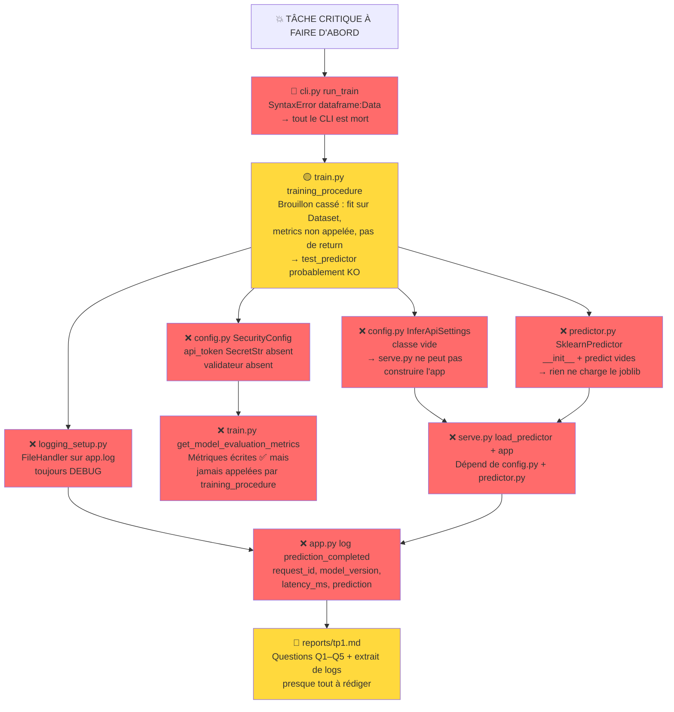
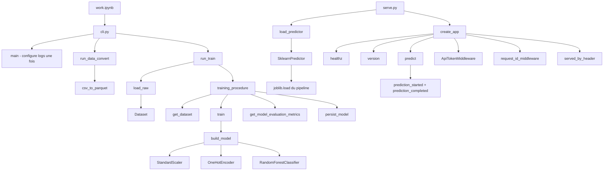
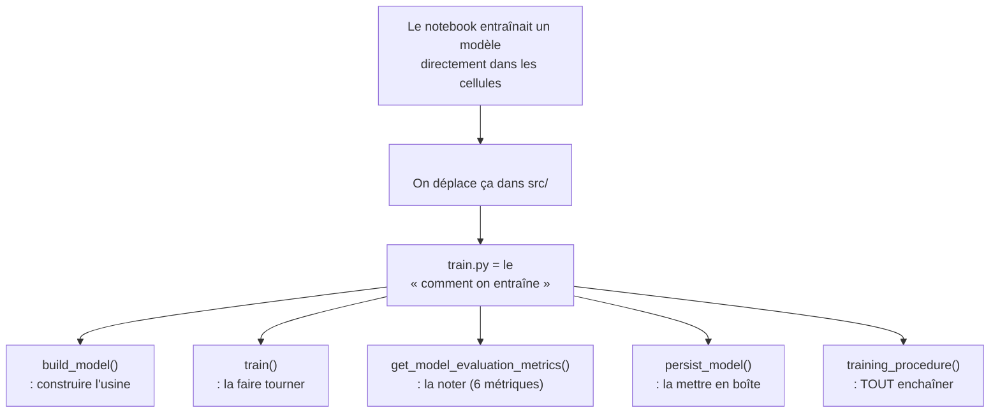

# TP1 – Arbre de travail (TODOs)

*Généré le: 2026-09-02 — basé sur une relecture réelle de chaque fichier sous `src/` et `tests/`.*

Cible : finir le TP **dans l'ordre de dépendance**, pas dans l'ordre alphabétique des tâches.

---

## 🗺️ Vue d'ensemble (arbre de dépendances)




Les interfaces, en résumé

| Connexion | Qu'est-ce qui se passe |
|---|---|
| `cli.py` | `run_train` charge le frame avec `data.load_raw` puis passe `settings.training` et le frame à `train.training_procedure`, et `main` configure les logs une seule fois avec `logging_setup.setup_logging` |
| `config.py` | `TrainingSettings` donne `data`, `training`, `logging` à CLI ; `InferApiSettings` donne `serving`, `security`, `logging` à `serve.py` — **jamais l'inverse** |
| `train.py` | `training_procedure` orchestre `get_dataset` → `train` → `get_model_evaluation_metrics` → `persist_model` → retourne le tuple |
| `serve.py` | construit `SklearnPredictor` depuis `settings.serving.model_path` + `prediction_threshold`, puis `create_app` avec ce chargeur |
| `predictor.py` | `SklearnPredictor` charge le joblib, applique le seuil, `get_version` via `file_creation_time` |
| `app.py` | le middleware token lit `security.api_token` dans les réglages que CLI a fournis |

C'est **le même** schéma qu'avant, sauf que toutes les boîtes pointent les unes vers les autres :

- les **rouges** = à faire (`run_train`, `training_procedure`, `SklearnPredictor`, `load_predictor`/`app` de `serve.py`, `api_token`, le handler fichier, la ligne `prediction_completed`)
- les **vertes** = déjà écrites

Si tu veux je te guide **à travers ce schéma** — tu pointes une flèche et je t'explique *pourquoi* ce lien existe, sans écrire le code.


🎯 L'histoire de `train.py` (30 secondes)



---

## 📦 Les imports : « ce dont j'ai besoin pour travailler »

Regarde le **haut** du fichier (`import`/`from ... import`). Chaque ligne dit : « j'emprunte un truc à un autre fichier ».

Exemple : `from sklearn.ensemble import RandomForestClassifier` = « je veux la classe `RandomForestClassifier`, qui vit dans le paquet `sklearn`, sous-module `ensemble`, et je veux l'utiliser ici ».

À la fin du fichier, quand on écrit `RandomForestClassifier(...)`, on **utilise** ce qu'on a importé plus haut.

**Exercice pour toi :** ouvre `train.py`, cherche la ligne avec `from inferapi.data import ...` (ou quelque chose qui *mentionne* `data`). **Qu'est-ce qui est emprunté depuis `data.py` ?** (`Dataset` ? `get_dataset` ? les deux ?)

---

## 🏗️ `build_model(training)` — l'usine à 2 étapes

```
data_processor  →  model
(préparation)      (la forêt aléatoire)
```

Le paramètre `training` (type `TrainingConfig`), c'est **juste** « les hyperparamètres qu'on lit depuis la config YAML » (`n_estimators=100`, `max_depth=8`, `seed=0`…). Ce n'est **pas** le fichier de données.

- **Étape `data_processor`** : un `ColumnTransformer`. Traduction : « pour les colonnes numériques → StandardScaler (les centrer/réduire) ; pour certaines colonnes catégorielles (job, month…) → OneHotEncoder (one = j'ai une catégorie sur N ?) »
- **Étape `model`** : un `RandomForestClassifier` — plein de petits arbres de décision qui votent ensemble, et le `max_depth` limite la taille des arbres

**Question :** qui, dans `train.py`, appelle **vraiment** `build_model(...)` ? (Índice : pas `training_procedure`.)

---

## 📏 `get_model_evaluation_metrics(...)` — on ne devine pas, on **mesure**

- `model.predict_proba(x)[:, 1]` = « donne-moi, **pour chaque ligne**, la probabilité de la classe 1 (=subscribe) »
- `(probabilities >= seuil).astype(int)` = « si proba ≥ seuil → je dis OUI (1), sinon NON (0) »
- `accuracy` = % de fois où on a raison ; `precision`/`recall` = métriques classiques (regarde le `zero_division` sur les appels)
- `roc_auc`/`average_precision` = qualité globale, **indépendante** du seuil

**Exercice :** compte le nombre de `return` dans cette fonction.

---

## ✂️ `train(train_config, dataset)` — là où tu as **déjà raison**

Regarde **bien** le paramètre `dataset: Dataset`. `Dataset` (vu dans `data.py`), c'est un **simple conteneur** qui range :

```
train_x/train_y : features/labels pour l'entraînement
val_x/val_y     : features/labels pour la validation
test_x/test_y   : features/labels pour le test
```

Donc `dataset.train_x` → **seulement** les features du **training**. **Tu n'as pas à re-splitter** : `data.py` l'a déjà fait.

Ensuite `model.fit(dataset.train_x, dataset.train_y)` → « **ajuste** l'usine avec ces données ».

Le log `logger.debug("split data ...", len(...), ...)` → **journalise** (sans f-string ! avec `%d`/`%s` = lazy evaluation) **les tailles** : « on a eu combien de lignes dans chaque split ? »

**Questions :**
1. Si tu passes `dataset.train_x` à `get_dataset` : **est-ce** correct ? (Índice : `get_dataset` attend un **DataFrame brut**, pas un `Dataset`.)
2. Combien de fonctions appellent réellement `train(...)` ?

---

## 📦 `persist_model(model, output)` — déjà écrit

`joblib.dump(model, output)` → on **conserve le modèle entraîné** sur le disque (un fichier `.joblib`). `output.parent.mkdir(parents=True, exist_ok=True)` → on **crée les dossiers** si nécessaires.

---

## 🧩 `training_procedure(...)` — l'assemblage qui **ne marche pas encore**

Lis la signature :

```python
def training_procedure(
    train_config: TrainingConfig,       # ← ce que l'usine "doit faire"
    dataframe: pd.DataFrame,             # ← les DONNÉES BRUTES (le frame CSV)
    output_model_path: Path | str,      # ← où écrire le .joblib
    overwrite_model: bool = True,        # ← on écrase si besoin ?
) -> tuple[Pipeline, dict[str, float]]:  # ← (usine entraînée, 6 mesures)
```

**Mais dans ton corps**, deux erreurs :

1. Tu fais `dataframe = get_dataset(dataframe)` : **tu** remplaces `dataframe` par un `Dataset`. Ce que le **caller** (qui ne l'appelle pas encore) **ne fait pas**, c'est… **splitter** le frame.

2. Tu appelles `build_model(train_config).fit(dataframe)` : tu passes un **`Dataset`** (pas un `DataFrame`/features) à `fit()`, et tu n'as **pas** écrit de `return` — donc tu renvoie `None` au lieu d'un tuple → et tu **n'utilises pas** `train()` ni `persist_model()`, qui existent **juste au-dessus**.

---

## 🗺️ Plan de bataille (à faire toi-même, pas moi)

| # | Question | Où chercher |
|---|----------|-------------|
| 1 | Quelle fonction **charge** le parquet/CSV ? | `data.py` : `load_raw(path)` |
| 2 | Qui **split** déjà le dataset ? | `data.py` : `get_dataset(frame, test_size=..., val_size=..., seed=...)` |
| 3 | Qui **fit** déjà ? | `train.py` : `train(...)` |
| 4 | Qui **mesure** déjà ? | `train.py` : `get_model_evaluation_metrics(...)` |
| 5 | Qui **sauvegarde** déjà ? | `train.py` : `persist_model(...)` |
| 6 | Quel `logger` existe déjà ? | `train.py` : l'appel `logger.debug("split data ...")` |

→ **Conclusion :** `training_procedure` **ne code RIEN de nouveau**. Elle **assemble** ce qui existe, **puis** journalise **une ligne** `model_trained` avec **les 6 métriques**, puis **returnne** `(model, metrics)`.

---

## ✅ Devoirs à rendre avant qu'on continue

1. **Ouvre `data.py` en parallèle**, cherche `get_dataset` et `load_raw`. **Est-ce que `load_raw` split, ou seulement charge ?**
2. Ouvre `train.py` dans un onglet et **roule** dans le terminal : `uv run pytest -q` (ou `make tests`). **Colle la sortie** ici.
3. **Réponds à la question** : qui, d'après `TP_FOLLOW.md`, *doit* appeler `training_procedure` ? (Índice : la **signature** dit `-> tuple[Pipeline, dict[str, float]]` : est-ce **compatible** avec `train()` qui, lui, retourne **un seul** `Pipeline` ?)


**Règle #1 :** rien ne sert de toucher à `serve.py` ou `reports/` avant que `cli.py` et `train.py` soient réparés : sans eux, rien ne tourne et on ne peut rien vérifier.

---

## 📦 Étape 1 — Réparer l'entrée de tout : `src/inferapi/cli.py`

### 1.1 `run_train` (TODO ligne ~100-103) — 🔴 À FAIRE EN PREMIER

**Ce qui existe déjà :**
- Le parseur `train` a **tous ses flags** : `--output` (déjà câblé), `--data`, `--n-estimators`, `--max-depth`, `--seed`, `--decision-threshold`, `--overwrite` (un par une, ajoutés)
- Le `config_flags` du `set_defaults` est **correct** : chaque flag pointe vers le bon champ de config

**Ce qui est faux :**
```python
def run_train(args, settings) -> int:
    training_procedure(train_config=settings, dataframe:Data, output_model_path="./data", overwrite_model=True)
```
- `dataframe:Data` dans un **appel** de fonction = **SyntaxError** (une annotation n'a pas sa place dans une liste d'arguments). Résultat : `import inferapi.cli` échoue → **toutes** les commandes (`inferapi train`, `inferapi data-convert`, `make model-train`, `make serve`, `make serve-debug`) sont mortes
- `Data` n'est défini nulle part dans le fichier
- `train_config=settings` passe tout le `TrainingSettings` au lieu de `settings.training` (le `TrainingConfig`)
- `output_model_path="./data"` est une valeur inventée : la vraie valeur vient de `args.output`
- `overwrite_model=True` en dur : ce doit être `args.overwrite`
- Pas de `return` : la signature promet `int` (code de retour = `0`)

**Questions pour toi (réponds-y dans le fichier, pas à côté) :**
1. Qu'est-ce que `load_raw` (déjà importé en haut du fichier) renvoie, et à quoi devrait ressembler le premier argument de `training_procedure` ?
2. Si `--data` n'est pas fourni, d'où vient le chemin du parquet ? (Indice : `settings.data.parquet_path` … mais quel chemin si le YAML dit `data/dataset.parquet` et que le fichier n'existe pas ?)
3. Que retourne `run_data_convert` à la fin ? Imite ce pattern.

---

## 🧠 Étape 2 — Cœur du TP : `src/inferapi/train.py`

### 2.1 `training_procedure` (TODO ligne ~117-127) — 🔴 À FAIRE EN DEUXIÈME

**Ce qui existe déjà :**
```python
def training_procedure(...):
    dataframe = get_dataset(dataframe)          # ← renvoie un Dataset, pas un DataFrame !
    build_model(train_config).fit(dataframe)   # ← .fit() sur un objet Dataset → explose
    get_model_evaluation_metrics               # ← référence seule, jamais appelée
```

**Ce qui manque (tout le corps) :**
- Découpage : utiliser `get_dataset(dataframe, test_size=..., val_size=..., seed=...)` — les valeurs viennent de `train_config`
- Entraînement : passer par `train(train_config, dataset)` (déjà écrite, ne recode pas la même chose)
- Évaluation : sur **`dataset.val_x` / `dataset.val_y`** (jamais sur le train, jamais sur le test), avec `train_config.decision_threshold`
- Journalisation : **un seul** événement `model_trained` contenant **les 6 métriques** + les tailles de splits (pattern `clé=%s ...`, lazy evaluation)
- Persistance : `persist_model(model, output_model_path)`
- `overwrite_model=False` + fichier déjà présent : que faut-il faire ? (Échouer clairement ? Écraser quand même ?)
- `return (model, metrics)` — la signature le promet

**Questions :**
1. Pourquoi évaluer sur la *validation* et pas sur le *train* ? Ni sur le *test* ?
2. Si le test passe mais que tu n'as pas écrit `return (model, metrics)`, quel appel dans `tests/test_predictor.py` va le détecter ?

### 2.2 `get_model_evaluation_metrics` (TODO ligne ~82-95) — ✅ DÉJÀ FAIT

**Ce qui existe déjà : les 6 métriques sont là :**
`positive_rate`, `accuracy`, `precision`, `recall`, `roc_auc`, `average_precision`

**Reste à vérifier (pas à réimplémenter) :**
- `probabilities >= threshold` : est-ce que `/` est le bon opérateur comparé au notebook ?
- `zero_division=0` sur precision/recall : quel cas ça évite ?

### 2.3 `train` (TODO lignes ~98-109) — ✅ DÉJÀ FAIT

- `model.fit(dataset.train_x, dataset.train_y)` : fit uniquement, comme demandé
- Log debug des tailles de splits : présent (6 valeurs, lazy evaluation)

**À garder :** ne pas y ajouter la validation/évaluation, c'est le rôle de `training_procedure`.

### 2.4 `build_model` (TODO lignes ~58-78) — ✅ DÉJÀ FAIT

- Pipeline `data_processor` (ColumnTransformer : numerical/StandardScaler, categorical_fixed/OneHot avec `KNOWN_CATEGORIES`, categorical_learned/OneHot `infrequent_if_exist`) + `model` (RandomForest avec hyperparams depuis `TrainingConfig`)

**Ne pas toucher** aux étapes nommées ; ne pas mettre d'hyperparamètre en dur.

---

## 🔐 Étape 3 — Configuration : `src/inferapi/config.py`

### 3.1 `SecurityConfig` (TODO ligne ~60-71) — ❌ À FAIRE

**Existant :** seulement `enable_api_key_check: bool = True`.

**À faire :**
- Ajouter `api_token: SecretStr` — **sans valeur par défaut**
- Ajouter un `@model_validator(mode="after")` qui lève une erreur si `enable_api_key_check=True` et `api_token is None`
- Regarde comment `app.py` l'utilise (`settings.security.api_token.get_secret_value()`) et le test `test_api_key_check_without_a_token_is_rejected` : c'est exactement ce qu'on attend de toi

**Questions :**
1. Pourquoi le jeton n'est PAS dans `configs/config.yaml` ?
2. Si quelqu'un met `ML520_SECURITY__API_TOKEN` dans son environnement : quel chemin est pris dans ta validation ?

### 3.2 `InferApiSettings` (TODO ligne ~121-123) — ❌ À FAIRE

**Existant :** `class InferApiSettings(WithYamlSources): ...`

**À faire :** déclarer **uniquement** les sections dont le service a besoin :
- `serving: ServingConfig`
- `security: SecurityConfig`
- `logging: LoggingConfig`
- avec le même `SettingsConfigDict(yaml_file="configs/config.yaml", env_file=".env", env_nested_delimiter="__", env_prefix="ML520_", extra="ignore")` que `TrainingSettings`

**À ne PAS mettre :** `data` ni `training` (le service n'a pas besoin des hyperparamètres) et le champ `api_token` n'est pas dans le YAML.

---

## 🔧 Étape 4 — `src/inferapi/predictor.py`

### 4.1 `SklearnPredictor` (TODO ligne ~48-51) — ❌ À FAIRE

**Existant :** seulement la classe vide avec `def __init__(self, artifact_path: Path, threshold: float = 0.5): ...`

**À faire :**
- `__init__` : sauvegarder `artifact_path` + `threshold` (la signature est déjà là), charger le pipeline avec `joblib.load(...)`
- `predict(features: pd.DataFrame) -> tuple[int, float]` :
  - `probabilities = self.model.predict_proba(features)[:, 1]`
  - `label = int(probabilities[0] >= self.threshold)`
  - `return (label, float(probabilities[0]))`
  - (optionnel) override `get_version()` : `file_creation_time(self.artifact_path).isoformat()` — `file_creation_time` est déjà importé

**Question :** pourquoi `[1]` dans `predict_proba` ? (Índice : que prédit le modèle ?)

## 📝 Étape 5 — Logging : `src/inferapi/logging_setup.py`

### 5.1 Handler fichier + `debug_file` (TODO lignes ~33-42) — ❌ À FAIRE

**Existant :** le handler stdout, avec le niveau qui vient de `log_settings.level.upper()`.

**À faire :**
```
file_handler = logging.FileHandler(log_settings.debug_file)   # après mkdir parents
file_handler.setFormatter(formatter)
file_handler.setLevel(logging.DEBUG)      # TOUJOURS DEBUG, quel que soit stdout
root.addHandler(file_handler)             # seulement si debug_file configuré
```

**Questions :**
1. Si `log_settings.debug_file is None` : qu'est-ce qu'on ajoute, rien ?
2. Pourquoi le handler fichier reste à DEBUG même si l'utilisateur met `--log-level INFO` ? (Índice : relis TODO ligne 33)
3. Vérifie que rien ne configure le logging au niveau *global scope* d'un module : tout doit passer par `setup_logging`.

## 🚀 Étape 6 — Service : `src/inferapi/serve.py`

### 6.1 `load_predictor` + `app` (TODO lignes ~10, 20-21, 25-26) — ❌ À FAIRE

**Existant :** imports de `create_app`, `InferApiSettings`, `Predictor`.

**À faire :**
- `load_predictor(settings)` : retourner `SklearnPredictor(settings.serving.model_path, settings.serving.prediction_threshold)` — c'est le **seul** module autorisé à nommer une implémentation concrète
- À la fin : `settings = InferApiSettings()` puis `app = create_app(settings, load_predictor)`

**Vérification :** `make serve` / `make serve-dev` / `make serve-debug` + les trois `curl` du TP, puis `make tests`.

## 🖥️ Étape 7 — Log de clôture : `src/inferapi/app.py`

### 7.1 Ligne `prediction_completed` (TODO ligne ~209-210) — ❌ À FAIRE

**Existant :** `logger.debug("prediction_started request_id=%s", ...)` est déjà là. `started` / `ended` sont calculés. `predictor`, `_model_version`, `label`, `probability` sont sous la main.

**À faire :** avant le `return PredictResponse(...)`, **une seule** instruction :

- `logger.info("prediction_completed request_id=%s model_version=%s latency_ms=%s prediction=%s probability=%s", <5 arguments>)`

**Questions :**
1. `latency_ms = (ended - started) * 1000` : quel type ? (arrondi ?)
2. `label` et `probability` viennent d'où dans le scope ?
3. Pourquoi `logger.info` et pas `logger.debug` pour la ligne de clôture ?

---

# 📋 Récapitulatif

## TODOs par fichier (ordre d'exécution)

| # | Fichier | TODO | État | Dépend de |
|---|---------|------|------|-----------|
| 1 | `cli.py` | `run_train` : SyntaxError + pas de return | 🔴 À FAIRE | rien — **commence ici** |
| 2 | `train.py` | `training_procedure` : corps entier | 🔴 À FAIRE | #1 (test_predictor) |
| 3 | `config.py` | `SecurityConfig.api_token` + validateur | ❌ À FAIRE | rien |
| 3 | `config.py` | `InferApiSettings` : sections serving | ❌ À FAIRE | rien |
| 4 | `predictor.py` | `SklearnPredictor` | ❌ À FAIRE | #3 |
| 4 | `logging_setup.py` | FileHandler DEBUG | ❌ À FAIRE | rien |
| 5 | `serve.py` | `load_predictor` + `app` | ❌ À FAIRE | #3, #4 |
| 6 | `app.py` | Log `prediction_completed` | ❌ À FAIRE | #5 |
| 7 | `reports/tp1.md` | Q1–Q4 | ✅ Ébauche Q1 | — |

## ✅ Déjà fait — ne pas recoder

| Fichier | Ce qui est déjà bon |
|---------|----------------------|
| `train.py` | `build_model` (pipeline + hyperparams), `get_model_evaluation_metrics` (6 métriques), `train` (fit + log splits), `persist_model` |
| `config.py` | `DataConfig`, `TrainingConfig`, `ServingConfig`, `LoggingConfig`, `WithYamlSources`, `TrainingSettings` |
| `cli.py` | Parseur `train` complet ; `config_flags` corrects ; `settings_from_args` ; `run_data_convert` |
| `app.py` | `create_app`, les middlewares (`ApiTokenMiddleware`, `request_id`, `served_by_header`), `PredictRequest/Response`, `_busy_wait` |
| `data.py` | `csv_to_parquet`, `load_raw`, `to_features_and_labels`, `get_dataset` |
| `utils.py` / `__init__.py` | `file_creation_time`, `__version__` |
| `tests/*` | `test_config`, `test_data`, `test_predictor` (tous dépendent des réparations) |

## ⚠️ Pièges récurrents

- Ne PAS corriger les erreurs `F401` avec `ruff check --fix` avant d'avoir implémenté : ces imports servent
- `SecretStr` se lit avec `.get_secret_value()`
- `requirements.txt` : déjà supprimé — optionnel, le régénérer avec `uv export`
- `pandas==2.2.3` est un pin : la consigne veut des intervalles (`>=,<`) ; `joblib` est importé dans `src/` mais pas déclaré
