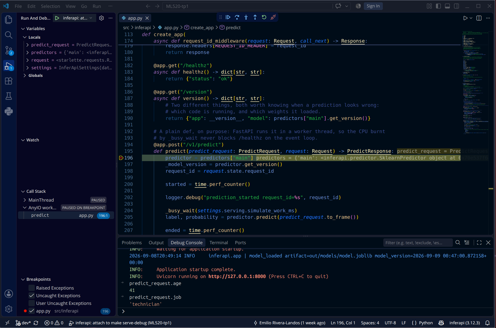

# TP1 - Rapport d'équipe

Équipe : <numéro>
Membres : <noms>

## Question 1 - Répartition des dépendances

Expliquez la logique de votre répartition des dépendances héritées entre
`[project].dependencies`, les groupes de dépendances et les extras, et justifiez les
paquets que vous avez écartés. Qu'en est-il de `scikit-learn-intelex` : où l'avez-vous
placé, avec quelles contraintes, et que voyez-vous dans `uv.lock` pour un coéquipier
sur une autre architecture ?

> Votre réponse ici.

## Question 2 - Les métriques et le seuil

Collez votre ligne `model_trained` au seuil configuré, puis celle obtenue avec
`--decision-threshold 0.3`.

```json
```

```json
```

Quelle exactitude obtiendrait un modèle qui prédit « non » systématiquement, et que
vaut donc la vôtre ? Commentez le déplacement de la précision et du rappel, dites quel
seuil vous mettriez en production et pour qui, et expliquez ce qui se produit si
`training.decision_threshold` et `serving.prediction_threshold` divergent.

> Votre réponse ici.

## Question 3 - Le jeton, la configuration et les logs

Roulez l'application: collez la au complet la ligne `settings_loaded` et expliquez ce que `SecretStr` y a changé.

```json
```

Pourquoi deux objets de réglages plutôt qu'un seul, et qu'est-ce que cela empêche
concrètement ? Qu'est-ce qui doit remplacer `.env` quand le service tourne ailleurs
que sur votre machine, et pourquoi ?

> Votre réponse ici.

## Question 4 - Ce que `app.py` ne fait pas

`app.py` ne construit ni ses réglages ni son modèle: qu'est-ce qui permet ceci?

> Votre réponse ici.


Si `app.py` instanciait lui-même son modèle et sa configuration, qu'est-ce qui serait plus difficile à faire?

> Votre réponse ici.


Enfin: que faudrait-il changer, et où exactement, pour servir un modèle PyTorch
plutôt que le modèle scikit-learn ?

> Votre réponse ici.

## Extrait de log

Un court extrait de `out/logs/app.log` montrant une requête `/v1/predict` complète
(l'événement DEBUG et l'événement de prédiction).

```json
```

## Débogueur

Capture d'écran du débogueur arrêté sur un point d'arrêt, panneau des variables
lisible. Commitez l'image dans `reports/img/` et référencez-la ici, le bundle de
remise la contiendra:


